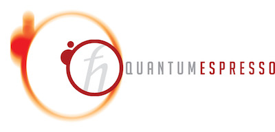

> This is the distribution of the Quantum ESPRESSO suite of codes (ESPRESSO:
> opEn-Source Package for Research in Electronic Structure, Simulation, and
> Optimization).

[](https://www.gnu.org/licenses/old-licenses/gpl-2.0.en.html)

## USAGE

Quick installation instructions for the impatient:

```
./configure [options]
make all
```

("make" alone prints a list of acceptable targets). Binaries go in bin/.
For more information, see the general documentation in directory Doc/,
package-specific documentation in \*/Doc/, and the web site
http://www.quantum-espresso.org/

## PACKAGES

- PWscf: structural optimisation and molecular dynamics on the electronic ground state, with self-consistent solution of DFT equations;
- CP: Car-Parrinello molecular dynamics;
- PHonon: vibrational and dielectric properties from Density-Functional Perturbation Theory;
- TD-DFPT: spectra from Time-dependent Density-Functional Perturbation Theory;
- EPW: calculation of electron-phonon coefficients in metals;
- PWneb: reaction pathways and transition states with the Nudged Elastic Band method;
- GWL: many-body perturbation theory in the GW approach using ultra-localised Wannier functions and Lanczos chains.

## Modular libraries
The following libraries have been isolated and partially encapsulated in view of their release for usage in other codes as well:

- UtilXlib: performing basic MPI handling, error handling, timing handling.
- FFTXlib: parallel (MPI and OpenMP) distributed three-dimensional FFTs, performing also load-balanced distribution of data (plane waves, G-vectors and real-space grids) across processors.
- LAXlib: parallel distributed dense-matrix diagonalization, using ELPA, SCALapack, or a custom algorithm.
- KS Solver: parallel iterative diagonalization for the Kohn-Sham Hamiltonian (represented as an operator),using block Davidson and band-by-band Conjugate-Gradient algorithms.
- LRlib: performs a variety of tasks connected with (time-dependent) DFPT, to be used also in connection with Many-Body Perturbation Theory.

## Contributing
Before contributing please read the [Contribution Guidelines](CONTRIBUTING.MD)


## LICENSE

All the material included in this distribution is free software;
you can redistribute it and/or modify it under the terms of the GNU
General Public License as published by the Free Software Foundation;
either version 2 of the License, or (at your option) any later version.

These programs are distributed in the hope that they will be useful, but
WITHOUT ANY WARRANTY; without even the implied warranty of MERCHANTABILITY
or FITNESS FOR A PARTICULAR PURPOSE. See the GNU General Public License
for more details.

You should have received a copy of the GNU General Public License along
with this program; if not, write to the Free Software Foundation, Inc.,
675 Mass Ave, Cambridge, MA 02139, USA.
